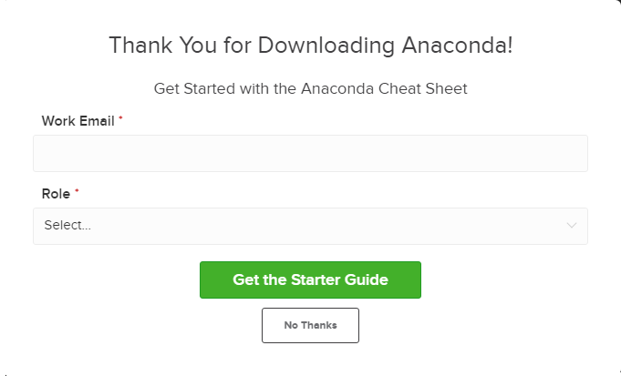
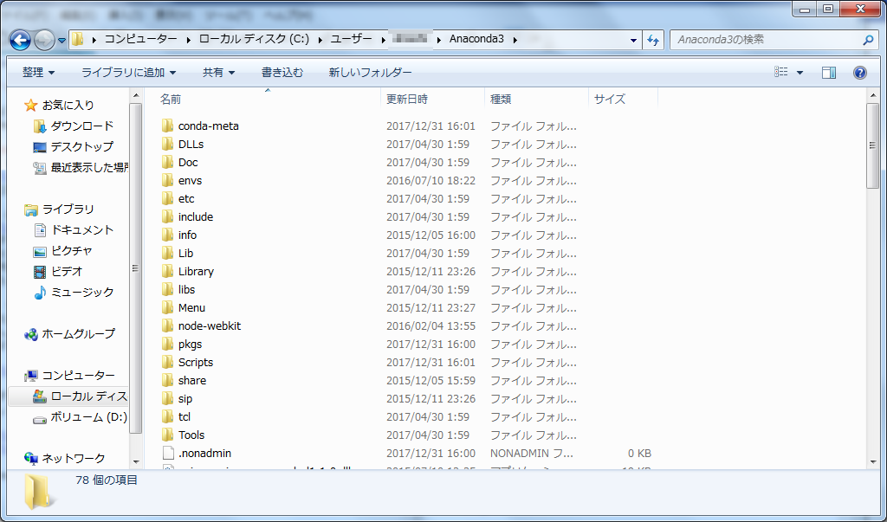
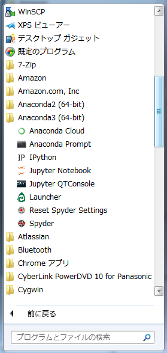

# prerequisites

1. anaconda
2. tableau

以上の2つのソフトウェアをダウンロードしておいてください。

### install ANACONDA  
以下の手順は、Windowsを標準として記載してあります。
Mac,Linuxをご使用の場合は適宜読み替えてください。
以前にAnacondaをインストールしたことのある方は、Anacondaのバージョンを確認してください。
- ptyhonのバージョン確認方法
```
python --version
```
python3.Xであれば問題ありません。

- https://www.anaconda.com/

上記URLの右上のオレンジの枠線から、ダウンロードページへ移動します

- https://www.anaconda.com/download/

ダウンロードページ中段にpythonのversion毎にAnacondaがそれぞれ用意されています。
今回はAnacondaのpython version3.6を使用しますので、上記のサイトから、python3.6 versionをダウンロードしてください。

- ダウンロード時にメールアドレスなどを入力するポップアップが表示されますが、必須ではありません。No Thanksをクリックしても問題ありません。(登録をすると、バージョンの変更などをメールで教えてくれるようになります)



ダウンロード後にAnaconda3-5.0.1-Windows-x86_64.exeをダブルクリックして展開(解凍)しておいて下さい。



User/[user_name]/Anaconda3
標準の場合は、ユーザーディレクトリの配下にAnaconda3というディレクトリが新規に作成されています。



スタートメニューから、anaconda pythonの機能が確認できます。
ここまでで、Anacondaのインストールは出来ています。


### install Tableau

- https://www.tableau.com/ja-jp/products/desktop

「今すぐ試す」をクリックしてください。

- https://www.tableau.com/ja-jp/products/trial

ダウンロード画面で、メールアドレスを入力してください。
メールアドレス入力後に、無料トライアル版をダウンロードしてください。

.exeファイルがダウンロードされますので、展開(解凍)しておいてください。
デスクトップに下記のアイコンが表示されていれば、使用可能になっているはずです。


以上で、事前準備は終了です。お疲れ様でした。

>> 今回の講義で使用するライセンスは、トライアル用のものですので2週間の使用制限があります。
継続して使用したい方は、大友までご連絡をお願いいたします。